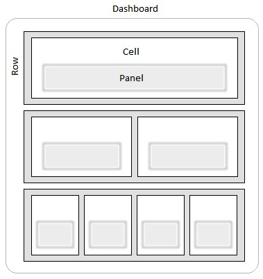

# Css

## **Splunk Tips:**

[https://dev.splunk.com/enterprise/docs/developapps/visualizedata/usesplunkdashboardstyles](https://dev.splunk.com/enterprise/docs/developapps/visualizedata/usesplunkdashboardstyles)

Aufbau Rows und Panels:



Aufbau von Row und Panels

```
dashboard-body
    dashboard-row
        dashboard-cell
            dashboard-panel
                panel-head
                panel-body

```

Aufbau einer Splunk View:

```
.dashboard-element
	.dashboard-element-header → progress, errors, title
	.dashboard-element-body → view
	.dashboard-element-footer → search-bar
```

## **CSS-Regeln allgemein:**

Info-Resource: [https://developer.mozilla.org/en-US/docs/Web/CSS](https://developer.mozilla.org/en-US/docs/Web/CSS)

### **Cascade:**

alle folgenden Regeln greifen ineinander:

### **Inheritance / Vererbung**

Child-Elements erben bestimmte Eigenschaften von ihren Eltern

Text-bezogene Attribute (Font, color, etc) 

Box-bezogene Attribute NICHT (margin, padding, background, border)

### **Order / Reihenfolge**

Browser → Default Browser Einstellungen

User → Der Nutzer kann eigene Browser-weite Einstellungen hinterlegen

Author → nur hier kommen wir 

external → eingebundene Scripte

embedded → direkt eingebettet im Script-Tag

inline → am Element selbst hinterlegt (style-Attribute)

zuletzt geladenes CSS gewinnt 

gleiche Selectoren innerhalb einer Datei

Lade-Reihenfolge externer Dateien

→ **ACHTUNG**: in SplunkAnswers habe ich öfter gesehen, dass styles in SimpleXML eingebunden werden. Im HTML-File wird es dann auch direkt im body eingebunden. Dies funktioniert aktuell zwar mit vielen gängigen Browsern. ABER es wurde aus dem HTML-Standard entfernt und wird somit irgendwann NICHT mehr unterstützt)

→ Styles (egal ob embedded oder als externe Datei) gehören in head! Aus Splunk Sicht also in eine externe Datei oder per JQuery mit append in head

### **Specificity**

[Regel](https://www.notion.so/22d200b2d56646c1b40d63122b1fa7ab)


[Beispiele](https://www.notion.so/88afd4679cc9434b87ba9149044ce334)